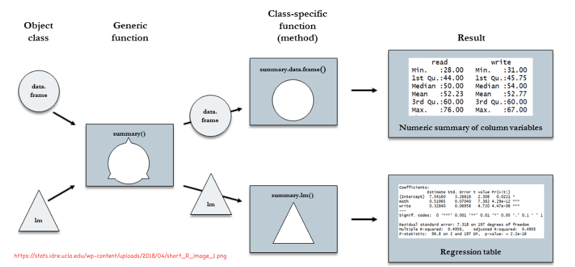

```{r setup, include=FALSE}
knitr::opts_chunk$set(echo = TRUE,message=FALSE,warning=FALSE, cache = TRUE)
```

```{r packages, echo=FALSE, message=FALSE, warning=FALSE}
library(tidyverse)
library(rvest)
```

# Outline 

* General statistical model


* Four-step modeling process


* Constant model

  * Mean, median
  
* Residuals

  * Absolute deviations
  * Squared deviations

* Comparing two means
  * Visualizations
  * $t$-test
  
* Effect size


---

# Outline

* Review of functions

* Vector basics  

* Atomic vectors  

* Using atomic vectors  

* Lists

---

## Function Review: Question 1  

Q: What belongs in the blank?   

A: (a) `from`, (b) `of`, (c) `in`, or (d) `%in%`  

<!-- Answer is "in" -->

```{r, eval = FALSE}
sales <- list(
    jan = c(9, 2, 10), 
    feb = c(19, 13, 11))

x <- vector("double", 2)
for (i ____ seq_along(sales)) { #<<
    x[i] <- mean(sales[[i]])
}
x
```

Output:  
```
[1]  7.00000 14.33333
```

---
## Function Review: Question 2 

Q: Complete the code to produce the output   

A: (a) `for` (b) `do` (c) `with` (d) `foreach`  

<!-- Answer is "for" -->
```{r, eval = FALSE}
x <- c(13, 12, 14, 15)

---- (i in x) { #<<
    if(i %% 2 == 0) {
        print(paste(i, "is an even number"))
    } else {
        print(paste(i, "is an odd number"))
    }
}
```

Output:  

```
[1] "13 is an odd number"
[1] "12 is an even number"
[1] "14 is an even number"
[1] "15 is an odd number"
```
---
## Function Review: Question 3

Q: Complete the code to produce the output  

A: (a) `ifelse` (b) `if` (c) `when`

<!-- Answer is "if" -->

```{r, eval = FALSE}
score <- 94
_____ (score > 60) { #<<
    print("Above 60!")
} else {
    print("At or below 60!")
}
```

Output:  

```
[1] "pass!"
```

---

## Function Review: Question 4 

Q: Complete the code to produce the output  

A: (a) `when` (b) `if` (c) `ifelse`

<!-- Answer is "if" -->
```{r, eval = FALSE}
day <- "sat"
____ (day == "sat") { #<<
    print("It is Saturday!")
}
```

Output:  

```
[1] "It is Saturday!"
```

---

## Function Review: Question 5

What will be the output?

<!-- Answer: c(3,3) -->

```{r, eval = FALSE}
x <- 2

add <- function() {
    x + 1
}

x1 <- add()
x2 <- add()

c(x1, x2)
```

Output: (a) `c(3, 4)` (b) `c(3, 3)` (c) `c(2, 3)` (d) An error


---

##  Vectors  

* Component parts of tibbles  

* Use in writing functions  

* Several kinds to know about

---

## Types of Vectors  

1. Atomic

    + Common types:  Logical, Integer, Double, Character    
    
    + Homogenous:  all same type
--
2. Lists  

    + Recursive  
    
    + Heterogeneous: can contain multiple types

---

## Hierarchy of Vector Types  

```{r, out.width = '50%', fig.align='center', fig.cap='',echo=FALSE}
knitr::include_graphics('figures/data-structures-overview.png') 
```

.footnote[
Source: R4DS
]


---

## Properties of Vectors  

Two key properties of every vector:  

1.  **type**: e.g. logical, character, ...  

2. **length**: number of elements  

---

## Atomic vector examples Part 1

```{r, eval = FALSE}
# logical vectors are simplest - only 3 values (T, F, NA)
1:10 %% 3 == 0   # `%%` = mod / divisible by
c(TRUE, TRUE, FALSE, NA)

# numeric vectors = double + integer
typeof(1)
typeof(1L)

# note that all doubles are approximations because of floating point
x <- sqrt(2) ^ 2
x
x - 2
sqrt(2)^2 == 2
near(2, sqrt(2)^2) 

```

---

## Atomic vector examples Part 2

* Types of NA values vary by vector type:

```{r, eval = FALSE}
# doubles have 4 special values (e.g. NaN = Not a Number)
c(-1, 0, 1, NA) / 0
# check with helper functions and not ==
is.na(c(-1, 0, 1, NA) / 0)  
```

---

## Character vectors

* Most complex type  

* Strings require more memory but ...  

    + R uses a "global string pool" ==> Each unique string stored in one place

```{r, eval = FALSE}
x <- "This is a reasonably long string."
pryr::object_size(x)
y <- rep(x, 1000)
pryr::object_size(y)
# y doesn't take 1000 times memory of x because each element of y is just
#   a pointer to the same string - pointers take less space
```

---

## Using Atomic Vectors

* Testing functions to verify type provided by **purrrr** package  
    
    + `is_numeric()`, `is_logical()`, `is_character()`, etc.  
    
```{r, eval = FALSE}
is_character(c(1, 2, 3, 4, 5))
is_character(c(1, 2, 3, 4, "5"))
is_character(c(1, 2, 3, 4, NA))
is_character(c(1, 2, 3, 4, NA_character_))
is_logical(c(T, T, F))
is_logical(c(TRUE, F, FALSE))
is_logical(c("true", "false", "true"))
```

---

## Using atomic vectors: coercion  

* Implicit coercion  

    + Happens when you use a vector in a specific context 
    that expects a certain type of vector  

---
class: inverse, center, top

background-image: url(https://imgs.xkcd.com/comics/types.png)
background-size: contain


---
## Coercion examples 

```{r, eval = FALSE}
# implicit coercion from logical to numeric - T to 1 and F to 0
x <- runif(1000)
y <- x > .75
sum(y)  # how many are greater than 0.5?
mean(y) # what proportion are greater than 0.5?
```

---

## More coercion examples

```{r, eval = FALSE}
# if multiple types, most complex type wins - cannot mix types in a vector
typeof(c(TRUE, 1L))
typeof(c(1L, 1.5))
typeof(c(1.5, "a"))
is_numeric(typeof(c(1.5, "a"))) 
is_double(typeof(c(1.5, "a")))
is_integer(typeof(c(1.5, "a")))
is_character(typeof(c(1.5, "a")))
```

---

## Recycling Vectors 

* Mixing vectors and "scalars" easy because of recycling  

* Built-in functions are **vectorized**  

* R will expand the shortest vector to the same length as the longest  

    + R warns when the length of the longer is not an integer multiple of the length of the shorter

---

## Recycling Examples


```{r, eval = FALSE}
# Stats calculations are simplified by recycling scalars
x<- sample(70:100, 5, replace = TRUE) 
x
x - mean(x)
#   tidyverse gives errors if recycle anything but a scalar, since can be dangerous
1:10 + 1:2
1:10 + 1:3  # this will produce a warning
tibble(x = 1:4, y = 1:2) # this will produce an error
tibble(x = 1:4, y = rep(1:2, 2))
tibble(x = 1:4, y = rep(1:2, each = 2))
```

---

## Review of Subsetting Vectors: Part 1 

```{r, eval = FALSE}
# 1. can subset a vector using a numeric vector containing only integers
#    where negatives indicate drops
x <- c("one", "two", "three", "four", "five")
x[c(3, 2, 5)]
x[c(1, 1, 5, 5, 5, 2)]
x[c(-1, -3, -5)]
x[c(1, -1)]  # this gives an error - can't mix pos and neg
```  


```{r, eval = FALSE}
# 2. can also subset with a logical vector
x <- c(10, 3, NA, 5, 8, 1, NA)
x[!is.na(x)]
x[x %% 2 == 0]   # get evens and missings
```

---

## Review of Subsetting Vectors: Part 2 


```{r, eval = FALSE}  
# 3. Subsetting with names
x <- c(abc = 1, def = 2, xyz = 5)
x[c("xyz", "def")]
```  

```{r, eval = FALSE}
# 4. can also get first row of matrix with x[1,] and first column with x[,1]
temp <- tibble(x = 1:4, y = rep(1:2, each = 2))
temp[1,]
temp[,1]
temp[-1,]
```

---

## Lists 

    + Can contain other lists  
    
    + Use `list()` to create lists
    
    + Use `str()` to inspect lists  
    
    + Can mix types of objects  
    
    + Subsetting: "[", "[[", "$"

---
## Visualizing Lists and Subsetting

* See R4DS Section 20.5.1 for examples to study! 

* Study subsetting commands  

    + "[" : extracts a sub-list. The result will always be a list.
    + "[[" :extracts a single component from a list;  removes a level of hierarchy from the list.
    + "$" : shorthand for extracting **named** elements of a list; works like "[[" except you don’t need to use quotes.

---

##  Data Example  

```{r, eval = FALSE}
str(mtcars)
typeof(mtcars)
attributes(mtcars)
attr(mtcars, "class")
```

---

## Create a Plot and Save It  

```{r, eval = FALSE }
g <- ggplot(mtcars) + 
  geom_point(aes(x = wt, y = mpg))
g
typeof(g)
str(g)
attributes(g)
```

---

## Explore the List Testing methods of extraction

```{r, eval = FALSE }
g[1]
g[[1]]
g$data
g[[1]][1]
g[[1]][[1]]
g[[1]][1,]
g[[1]][,1]
g$data$mpg
g[2]
g[9]
g[9]$labels$x
g$labels$x
```

---

## Now fit a least squares line using the code below

* Fit the model and explore the components of the regression results using methods of subsetting lists. 

```{r, eval = FALSE}
# Following creates a list of regression results in lsq_mod
lsq_mod <- lm(mpg~wt, data = mtcars)
str(lsq_mod)
attributes(lsq_mod)
lsq_mod$coefficients
lsq_mod$call
```

---

## Attributes of vectors  

* Names  

* Dimensions  

* Classes:  generic functions `summary()`, `print()`, etc. 

---

## Generic Functions and Methods  

```{r, out.width = '100%', fig.align='center', fig.cap='',echo=FALSE}

```

---
## Check Methods of Generic Functions  

* Some generic functions have many, many methods!!

```{r, eval = FALSE}
methods(summary)
methods(print)
methods(residuals)
```


