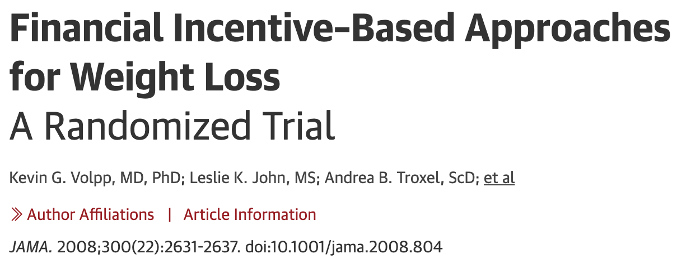

class: highlight-last-item

```{r setup, include=FALSE}
knitr::opts_chunk$set(
  fig.width=9, fig.height=4, fig.retina=3, 
  out.width="90%",
  message = FALSE
)

```


```{r packages, echo=FALSE, message=FALSE, warning=FALSE}
library(tidyverse)
library(rvest)
library(mosaic)
library(Stat2Data)
data("WeightLossIncentive4")
```

```{r xaringanExtra, echo=FALSE}
xaringanExtra::use_xaringan_extra(c("panelset", "scribble"))
xaringanExtra::use_clipboard()
xaringanExtra::use_tile_view()
```


```{css echo=FALSE}
.highlight-last-item > ul > li,
.highlight-last-item > ol > li {
  opacity: 0.5;
}
.highlight-last-item > ul > li:last-of-type,
.highlight-last-item > ol > li:last-of-type {
  opacity: 1;
}
```

# Outline 

- Statistical model

--

- 4-step process

--

- Case study

--

- R Code


---

# Statistical modeling

- A general statistical model:

$$
Y = f(X) + \epsilon
$$

--

- Goal: Find a model for a relationship between a **response variable** ($Y$) and one or more **explanatory/predictor** variables $(X_1, X_2, \ldots, X_k)$.
---
background-image: url(figures/nyt_model.png)
background-size: contain

---
class: highlight-last-item

# Four-step Modeling Process

1. **Choose**: Pick a form for the model.

--

1. **Fit**: Estimate any parameters.

--

1. **Assess**: Is the model adequate? Could it be simpler? Are conditions met?

--

1. **Use**: Answer the question of interest


---

# Study: Financial incentives for weight loss 

.pull-left[

```{r echo = FALSE}
# local

```

- **Research question**: Do financial incentives help people lose weight more successfully?

]

--

.pull-right[
- **Participants**: healthy adults 30-70 with BMI of 30-40 

- **Treatment groups**: Randomly assigned to treatment groups (*Group*):

  - Financial incentives vs
  
  - Control (monthly weigh-ins, no financial incentive)
  
- **Response**: *WeightLoss* = Before - After
  - Positive $\Rightarrow$ weight loss

- R Dataset: **WeightLossIncentive4**
]

---

# Study: Financial incentives for weight loss 
## The Data

.panelset[
.panel[.panel-name[Access and Group Size]
```{r fi1}
# Load data set
data("WeightLossIncentive4")
tally(~Group, data = WeightLossIncentive4)
```
]
.panel[.panel-name[Control]
```{r fi2}
filter(WeightLossIncentive4, Group == "Control")
```
]
.panel[.panel-name[Incentive]
```{r fi3}
filter(WeightLossIncentive4, Group == "Incentive")
```
]
]

<!----->


---
### Describing the Data Graphically and Nummerically

.panelset[
.panel[.panel-name[R Code]
```{r figraph1, eval = FALSE}
# coord_flip makes dotplot vertical
gf_dotplot(~WeightLoss | Group, data = WeightLossIncentive4) + 
  coord_flip()
gf_boxplot(WeightLoss ~ Group, data = WeightLossIncentive4)
# summary statistics by group
favstats(WeightLoss ~ Group, data = WeightLossIncentive4)
```
]
.panel[.panel-name[Dotplot]
```{r figraph2, echo = FALSE}
gf_dotplot(~WeightLoss | Group, data = WeightLossIncentive4) + 
  coord_flip()
```
]
.panel[.panel-name[Boxplot]
```{r figraph3, echo = FALSE}
gf_boxplot(WeightLoss ~ Group, data = WeightLossIncentive4)
```
]

.panel[.panel-name[Summary Statistics]
```{r fi_stats, echo = FALSE}
favstats(WeightLoss ~ Group, data = WeightLossIncentive4)
```
]
]

<!----->

---
# Step 1: Choose a Model

.pull-left[
### Characteristics

Consider a model suggested by the data: 
- Different means for each treatment group (
$\mu_i$
)

- Common variability ( 
$\sigma$
)

- Normally distributed (symmetric) errors (
$\epsilon$
)
]

--

.pull-right[
### Formally stated:
$$
Y = \mu_i + \epsilon \mbox{ where } \epsilon \sim N(0, \sigma_i)
$$

### By group:

- Control Group: $$Y = \mu_1 + \epsilon \mbox{ so } Y \sim N(\mu_1, \sigma_1)$$

- Incentives Group: $$Y = \mu_2 + \epsilon \mbox{ so } Y \sim N(\mu_2, \sigma_2)$$


]


---
# Step 2: Fit the Model

### Process

- Depends on study design, types of variables, and proposed model.

--

### Financial incentives model

  - Compute sample estimates of means $\bar y_i$  and standard deviations $s_i$
  
  - Fitted values differ by treatment group: 
  
  $$\hat y = \bar y_i$$
  - **Note**: No error term in the *fitted model*
  
--

  - **Interpretation**: Predicted weight loss for a member of group $i$.

---

# Step 3: Assess the Model 

- Determine whether the conditions of the model hold

  - Look at residual $y-\hat y_i$ 

- Consider whether a different (simpler) model might fit.

---

## Check conditions on residuals

- Use R function `lm()` to fit the two-mean model (see code example)

- Verify fitted values

- Plot residuals to check conditions

---

## R code and output for checking conditions  on residuals

.panelset[
.panel[.panel-name[R Code]
```{r fimod1, eval = FALSE}
# fits two-means model
wl_mod <- lm(WeightLoss ~ Group, data = WeightLossIncentive4)
# adds fitted and residual values to the dataset
WeightLossIncentive4 <- WeightLossIncentive4 %>% 
  mutate(yhat = fitted(wl_mod), resid = resid(wl_mod))
# Check the values
head(WeightLossIncentive4)
tail(WeightLossIncentive4)
# Residual dotplots 
gf_dotplot(~resid | Group, data = WeightLossIncentive4) + 
  coord_flip()
# Residual quantile plots
gf_qq(~ resid | Group, data = WeightLossIncentive4) %>% gf_qqline()
```
]

.panel[.panel-name[Fitted values and residuals]
```{r fimod2, echo = FALSE}
# fits two-means model
wl_mod <- lm(WeightLoss ~ Group, data = WeightLossIncentive4)
# adds fitted and residual values to the dataset
WeightLossIncentive4 <- WeightLossIncentive4 %>% 
  mutate(yhat = fitted(wl_mod), resid = resid(wl_mod))
# Check the values
head(WeightLossIncentive4)
tail(WeightLossIncentive4)
```
]
.panel[.panel-name[Dotplot]
```{r fimod3, echo = FALSE}
gf_dotplot(~resid | Group, data = WeightLossIncentive4) + 
  coord_flip()
```
]
.panel[.panel-name[Normal quantile plots]
```{r fimod4, echo = FALSE}
gf_qq(~ resid | Group, data = WeightLossIncentive4) %>% gf_qqline()
```
]

]

<!----->

---

# Test versus a simpler model

Carry out a two-sample $t$-test for financial incentives data


$$
H_0: \mu_1 = \mu_2  \quad\Rightarrow \quad Y = \mu + \epsilon \quad \mbox{ (one mean model)} 
$$

versus 

$$
H_a: \mu_1 \neq \mu_2 \quad \Rightarrow \quad Y = \mu_i + \epsilon \quad \mbox{ (two means model)}
$$
---
### Two-sample t-test for financial incentives data

**Which model is preferred?**

.panelset[
```{r, panelset = TRUE}
t.test(WeightLoss ~ Group, data = WeightLossIncentive4)
```
]

---
# Step 4: Use the Model

- Estimate treatment effect

- Fund more studies

- Health care policy implications


