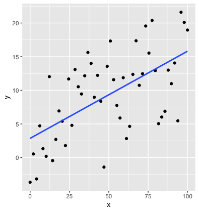
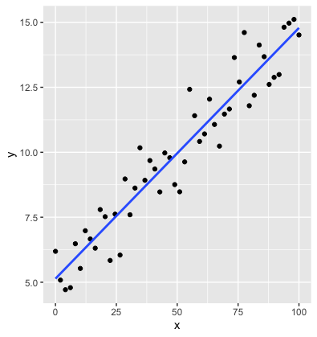

class: highlight-last-item

```{r setup, include=FALSE}
knitr::opts_chunk$set(
  fig.width=9, fig.height=4,  
  out.width="90%",
  message = FALSE
)

```


```{r packages, echo=FALSE, message=FALSE, warning=FALSE}
library(tidyverse)
library(mosaic)
library(Stat2Data)
library(gridExtra)
library(plotly)
data("SpeciesArea")
data("CountyHealth")
data("LongJumpOlympics")
MidtermFinal <- read.csv("http://people.kzoo.edu/enordmoe/math360/MidtermFinal.csv")
```

```{r xaringanExtra, echo=FALSE}
xaringanExtra::use_xaringan_extra(c("panelset"))
xaringanExtra::use_clipboard()
xaringanExtra::use_tile_view()
```


```{css echo=FALSE}
.highlight-last-item > ul > li,
.highlight-last-item > ol > li {
  opacity: 0.5;
}
.highlight-last-item > ul > li:last-of-type,
.highlight-last-item > ol > li:last-of-type {
  opacity: 1;
}
```

# Outline 

- ANOVA for Simple Linear Regression
--

- Partitioning Variability

  - $R^2$

--

- Correlation

  - Test for correlation coefficient $r$
  
--

- Practical vs Statistical significance revisited

  - Effect size considerations
  
---
## Analysis of Variance (ANOVA) for Regression

### Our framework

$$
\mbox{Data} = \mbox{Model }+\mbox{ Error} 
$$
--

### Question:

- Does the explanatory variable help "explain" the variability in the response?

<br>


$$
\mbox{Total variability} = \mbox{Explained variabilty }+ \mbox{Unexplained variability}
$$

<br>

- **Key question**: Does the MODEL explain a “significant” amount of the TOTAL variability?


---
background-image: url(figures/decomposing_regression_variability_v2.png)
background-size: contain


---
background-image: url(figures/thomas-t-OPpCbAAKWv8-unsplash.jpg)
background-size: 200px
background-position: 90% 8%

## The Amazing Identity

- Decomposition of variabilty around the mean $\bar Y$:
$$\mbox{SSTotal }=\mbox{ SSModel }+\mbox{ SSE}$$

- In formula terms:
$$\sum(y-\bar y)^2=\sum(\hat y-\bar y)^2=\sum(y-\hat y)^2$$
<br>

- **Intuitive Ideal:** A good model should do better than just predicting $\hat y=\bar y$ by using $X$ to *explain* away the uncertainty in $Y$.

---
## ANOVA for a Simple Linear Regression Model

- To test the effectiveness of the simple linear model, the hypotheses are

$$
\begin{align}
H_0:\beta_1&=0\\
H_a:\beta_1&\neq 0
\end{align}
$$

- The **ANOVA table** is

| Source | Degrees of<br>Freedom | Sum of<br> Squares | Mean<br>Square |             $F$-statistic             |
|:------:|:---------------------:|:------------------:|:--------------:|:-------------------------------------:|
| Model  |           1           |      SSModel       |    MSModel     | $F=\frac{\mbox{MSModel}}{\mbox{MSE}}$ |
| Error  |          n-2          |        SSE         |      MSE       |                                       |
| Total  |          n-1          |      SSTotal       |                |                                       |

- Given LINC-R conditions, the $F$-statistic has an $F$ distribution with 2 and $n-2$ degrees of freedom.

---
## Example: $P$-value from the $F$ distribution

```{r, fig.height = 3}
xpf(3.2, df1 = 1, df2 = 29, lower.tail = FALSE)
```

- The $P$-value is always the *upper* tail probability.

---
## Example: MidtermFinal ANOVA Output

.panelset[

```{r, panelset = TRUE, fig.height = 3.5}
mod1 <- lm(Final ~ Midterm, data = MidtermFinal)
anova(mod1)
```
]

---
## Example: MidtermFinal `lm()` Output

.panelset[

```{r, panelset = TRUE, fig.height = 3.5}
summary(mod1)
```
]

---
## Questions

1. What connections can you find between these two sets of results?

2. Is the regression *practically significant*?

3. What's the deal with the `Multiple R-squared`?


---

### What is $r^2$? 

- $r^2$ is the proportion of total variability in the response $(Y)$ that is "explained" by the model.

- $r^2$ can be calculated from the ANOVA decomposition:
$$
r^2 = \frac{\mbox{SSModel}}{\mbox{SSTotal}}=1- \frac{\mbox{SSE}}{\mbox{SSTotal}}
$$
<br>
- **Your turn:** Check using R output for **MidtermFinal** data. 

--

  - Check: $r^2=0.569\Rightarrow$ The model explains 56.9% of the variability in Final Exam scores.
  
  
---

### Why is it called $r^2$? 

.pull-left[

]
.pull-right[

]

---

## Testing the Significance of a Regression

- Test based on the correlation coefficient

$$
\begin{align}
H_0:&\rho=0 \\
H_a:&\rho\neq 0 \\
\end{align}
$$

- Test statistic

$$
t=\frac{r\sqrt{n-2}}{\sqrt{1-r^2}} \sim t_{n-2}
$$

- Find the $p$-value using a $t$ distribution with $n-2$ degrees of freedom.

---
## Test of Correlation Using R Software

```{r}
cor.test(Final~Midterm, data = MidtermFinal)
```

- **Question:** What numbers look familiar?

---
## Three Regression Tests

### 1. $t$-test for slope

.pull-left[
**Hypotheses**
$$
\begin{align}
H_0:&\beta_1=0 \\
H_a:&\beta_1\neq 0 \\
\end{align}
$$
]
.pull-right[
**Test statistic**
$$t=\frac{\hat\beta_1}{\mbox{SE}_{\hat\beta_1}}\sim t_{n-2}$$
]

---

## Three Regression Tests

### 2. ANOVA for  regression $F$-test 

.pull-left[
**Hypotheses**
$$
\begin{align}
H_0:&\beta_1=0 \\
H_a:&\beta_1\neq 0 \\
\end{align}
$$
]
.pull-right[
**Test statistic**
$$F=\frac{\mbox{MSModel}}{\mbox{MSE}}\sim F_{2,n-2}$$
]


---

## Three Regression Tests

### 3. $t$-test for Correlation Coefficient

.pull-left[
**Hypotheses**
$$
\begin{align}
H_0:&\rho=0 \\
H_a:&\rho\neq 0 \\
\end{align}
$$
]
.pull-right[
**Test statistic**
$$t=\frac{r\sqrt{n-2}}{\sqrt{1-r^2}} \sim t_{n-2}$$
]

---

### Three Regressions Tests

- All three are equivalent

- All test the significance of the linear regression relationship

---

### Effect sizes

- Why is the following a meaningful measure of **effect size**

$$
f^2 = \frac{R^2}{1-R^2}
$$

  - This is known as **Cohen's $f^2$**.