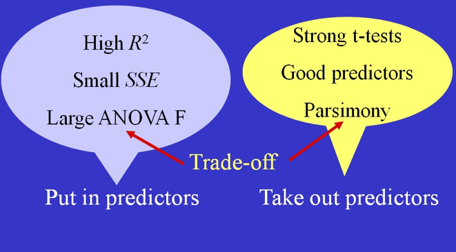

class: highlight-last-item

```{r setup, include=FALSE}
knitr::opts_chunk$set(
  fig.width=9, fig.height=4,  
  out.width="90%",
  message = FALSE
)

```


```{r packages, echo=FALSE, message=FALSE, warning=FALSE}
library(tidyverse)
library(mosaic)
library(Stat2Data)
library(gridExtra)
library(plotly)
data("NFLStandings2016")

```

```{r xaringanExtra, echo=FALSE}
xaringanExtra::use_xaringan_extra(c("panelset"))
xaringanExtra::use_clipboard()
xaringanExtra::use_tile_view()
```


```{css echo=FALSE}
.highlight-last-item > ul > li,
.highlight-last-item > ol > li {
  opacity: 0.5;
}
.highlight-last-item > ul > li:last-of-type,
.highlight-last-item > ol > li:last-of-type {
  opacity: 1;
}
```

# Outline 

- Multiple regression

  - Model
  
  - Prediction equation
  
  - Standard error of the residuals
  
  - Correlation matrix

  - Inference in Multiple Regression
  
  - Partitioning Variability
  
  - Adjusted $R^2$
  
  - Multiple Regression for Confidence and Prediction Intervals

---

## Simple Linear Regression Model Review

$$
\begin{gather}
Y = \beta_0 + \beta _1 X + \epsilon \\[2ex]
\mbox{where } \epsilon \overset{\text{iid}}{\sim} N(0, \sigma_\epsilon)
\end{gather}
$$

--

**Question:** What if we have more than one predictor?

---

## Multiple Regression Model

$$
\begin{gather}
Y = \beta_0 + \beta _1 X_1 + \beta_2 X_2 + \cdots + \beta_k X_k+ \epsilon \\[2ex]
\mbox{where } \epsilon \overset{\text{iid}}{\sim} N(0, \sigma_\epsilon)
\end{gather}
$$

--

### Data 

  - A dataframe with $n$ rows
  
  - Quantitative response variable $Y$
  
  - Predictors $X_1, X_2, \ldots, X_k$ 


---

## Multiple Regression: The 4-Step Process

.pull-left[
(1) **Choose** a form of the model

  - Select predictors
  
  - Determine appropriate functions of predictors
  
(2) **Fit** the model

  - Estimate coefficients $\hat\beta_0, \hat\beta_1, \ldots, \hat\beta_k$
  
  - Estimate standard error of the residuals $\hat\sigma_\epsilon$
]

--

.pull-right[
(3) **Assess** the fit

  - Check residual plots
  
  - Test the overall fit using ANOVA, $R^2$, and $R^2_{\text{adj}}$
  
  - Test individual predictors using $t$-tests

(4) **Use**

  - Obtain predictions $\hat Y$
  
  - Compute **prediction** intervals and **confidence intervals**
]
  
---

## Example: Multiple Predictors using NFL Standings Data

- Response variable: $Y=\text{WinPct}$
- Predictors:
  - $X_1=\text{PointsFor}$
  - $X_2=\text{PointsAgainst}$
  
---

## NFL Example: Data Plots Plotly Code

```{r, fig.height = 6, eval = FALSE}
# Change proportion to Percent to make coefficients easier to work with
NFLStandings2016 <- mutate(NFLStandings2016, WinPct = 100*WinPct)
plot_ly(data = NFLStandings2016, x=~PointsFor, y=~PointsAgainst, z=~WinPct, type="scatter3d", mode="markers", color=~WinPct,  text= ~Team)
```


---

## NFL Example: Data Plots Output

```{r, echo = FALSE, fig.height = 6}
# Change proportion to Percent to make coefficients easier to work with
NFLStandings2016 <- mutate(NFLStandings2016, WinPct = 100*WinPct)
plot_ly(data = NFLStandings2016, x=~PointsFor, y=~PointsAgainst, z=~WinPct, type="scatter3d", mode="markers", color=~WinPct,  text= ~Team)
```

---

## NFL Example: More Scatterplots

.panelset[

```{r, panelset = TRUE}
# scatterplot3d uses different syntax from ggplot2
library(scatterplot3d)
s3d <- with(NFLStandings2016,
           scatterplot3d(PointsFor,PointsAgainst,WinPct, 
                         type = "h",color = "blue", angle = 70, 
                         scale.y = 1, pch = 16, main = "3d Scatterplot")
           )

```
]

---

### NFL Example: Scatterplot with Fitted Regression Model

```{r, echo = FALSE}
mod1 <- lm(WinPct ~ PointsFor + PointsAgainst, data = NFLStandings2016)
s3d <- with(NFLStandings2016,
         scatterplot3d(PointsFor, PointsAgainst, WinPct, type = "h", color = "blue", pch = 16, angle = 50, main = "3d Scatterplot",xlim = c(250, 550), ylim = c(250,500))
)
s3d$plane3d(mod1, lty.box = "solid")
```

---

### Fitted Prediction Equation

```{r}
mod1 <- lm(WinPct ~ PointsFor + PointsAgainst, data = NFLStandings2016)
mod1
```

$$
\widehat{\text{WinPct}} = 78.54 + 0.1699\text{ PointsFor} -0.2482\text{ PointsAgainst}
$$


---

## NFL Example: Regression Summary Output

.panelset[

```{r, panelset = TRUE, fig.height = 3.5}
mod1 <- lm(WinPct ~ PointsFor + PointsAgainst, data = NFLStandings2016)
summary(mod1)
```
]

---

## T-tests for Slopes  

- Multiple "slopes" to test (each coefficient)

.pull-left[
**Hypotheses**
$$
\begin{align}
H_0:&\beta_i=0 \\
H_a:&\beta_i\neq 0 \\
\end{align}
$$
]
.pull-right[
**Test statistic**
$$t=\frac{\hat\beta_i}{\mbox{SE}_{\hat\beta_i}}\sim t_{n-k-1}$$
]

---
## Confidence Intervals for Slopes  

- A confidence interval for the true value of any multiple regression coefficient, $\beta_i$
 has the form
$$\hat\beta_i\pm t^* \cdot\text{SE}_{\hat\beta_i}$$

  - $t^*$ is the critical value from the $t$-distribution with $n-k-1$ degrees of freedom.
  
  - $\text{SE}_{\hat\beta_i}$ is otained from R output.
  
- Confidence intervals can be obtained directly using the `confint()` function in R.

---

## Standard Error of the Multiple Regression Model

- Recall condition: $\epsilon\sim N(0, \sigma_\epsilon)$

<br>

- Estimate standard error:


$$
\hat\sigma_\epsilon = \sqrt{\text{MSE}}= \sqrt{\frac{\text{SSE}}{n-k-1}}
$$

- Note that degrees of freedom depend on number of predictors.

---

## NFL Example: ANOVA  Output

.panelset[

```{r, panelset = TRUE, fig.height = 3.5}
anova(mod1)
```
]

---

## t-test for Correlation versus t-test for Slope

.pull-left[
- $t$-test for slope $H_0:\beta_i=0$: 

  - Assesses the linear association **after accounting for the other predictors** in the model.

- $t$-test for correlation $\rho =0$: 

  - Assesses the linear association between two variables **by themselves**.

**Important**: These two tests are not equivalent in multiple regression.

]
.pull-right[

```{r}
cor.test(WinPct ~ PointsFor, data = NFLStandings2016)
```

]
---

## ANOVA Test for Overall Variability

- Test the following hypotheses

$$
\begin{align}
H_0&:\beta_1=\beta_2=\cdots=\beta_k=0\\[1ex]
H_a&: \text{At least one } \beta_i\neq 0
\end{align}
$$

<br>

|   Source  |    df   | Sum of<br>Squares |   Mean<br>Square  |      F      |   $p$-value   |
|---------|:-------:|:-----------------:|:-----------------:|:-----------:|:-------------:|
| Model     |   $k$   |     $SSModel$     |    $SSModel/k$    | $MSModel/MSE$ | $F_{k,n-k-1}$ |
| Residuals | $n-k-1$ |       $SSE$       | $MSE=SSE/(n-k-1)$ |             |               |
| Total     |  $n-1$  |     $SSTotal$     |                   |             |               |

<br>

- Test using $F=MSModelMSE$ with $k$ and $n-k-1$ degrees of freedom.

---

## NFL Example: ANOVA Table

- Use `anova_alt.r` to create the `anova_alt()` function.

```{r anova_alt1}
mod1 <- lm(WinPct ~ PointsFor + PointsAgainst, data = NFLStandings2016)
# The file anova_alt.r must be in the same folder
source("anova_alt.r")
anova_alt(mod1)
```


---

## Why do we call it $R^2$?

$$
R^2=\frac{\text{SSModel}}{\text{SSTotal}}
$$

- For a simple linear model:
  - $R^2$ is the squared correlation coefficient $R^2=r^2$.
<br>
- For multiple regression:
  - Each predictor $X_i$ has a different correlation with $Y$.
  - $R^2$ is correlation between the observed and predicted values:
  $$R^2=\text{corr}(y,\hat y)$$
  
<br>
**Note:** This interpretation is not needed for simple correlation but also holds there.

---

## What makes a good multiple regression model?

.center[

]
.footnote[Source: Stat2e Resources]

---

## Purposes and Approaches to Regression Modeling

.pull-left[
### Purposes

1. Model and understand

2. Predict 

### Competing goals

1. **Parsimony**: construct a simple model

2. **Increase $R^2$**: construct a complex model

]

--

.pull-right[
### Tradeoffs

- Adding terms to a model:

  - Increases SSModel
  
  - Decreases SSE
  
  - Increases $R^2$

### Practical question 

- Is the increase in $R^2$ worth the added complexity?
]

---
background-image: url(https://source.unsplash.com/7-ToFEHzMNw)
background-size: 200px
background-position: 90% 8%

### Adjusted $R^2$ to the Rescue

- For simple regression we used:

$$
R^2 = \frac{SSModel}{SSTotal}=1-\frac{SSE}{SSTotal}
$$

- An "adjusted" version is preferred for multiple regression:

$$R^2_{\text{adj    }} = 1-\frac{SSE/(n-k-1)}{SSTotal/(n-1)}=1-\frac{\hat\sigma^2_{\epsilon}}{s^2_y}$$

- The adjustment is a "penalty" for adding parameters to the model.

- Can be used to compare models with different numbers of predictors.
---

### NFL Regression Output Revisited

.panelset[

```{r, panelset = TRUE, fig.height = 3.5}
mod1 <- lm(WinPct ~ PointsFor + PointsAgainst, data = NFLStandings2016)
summary(mod1)
```
]

---

## Confidence Intervals and Prediction Intervals for Multiple Regression

- Obtain predictions by substituting $x$ values of interest:

$$\hat y = \hat\beta_0 + \hat\beta_1 x_1^* + \cdots + \hat\beta_k x_k^*$$

- As before, prediction intervals are much wider than confidence intervals

- Use R to obtain confidence and prediction intervals

---

### NFL Regression Prediction Examples

- Average (expected) winning percent for all teams with `PointsFor=350` and `PointsAgainst=300`.

```{r fig.height = 3.5}
newxvals <- data.frame(PointsFor = 350, PointsAgainst = 300)
predict(mod1, newdata = newxvals, interval = "confidence")
```


- Winning percent for a single team with `PointsFor=350` and `PointsAgainst=300`.

```{r fig.height = 3.5}
predict(mod1, newdata = newxvals, interval = "prediction")
```
]
