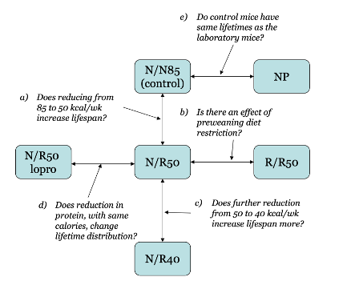

```{r packages, echo=FALSE, message=FALSE, warning=FALSE}
library(tidyverse)
library(mosaic)
library(Stat2Data)

```

## One-way ANOVA Inference {.smaller}

::: incremental
-   $P$-value

-   **ANOVA conditions**

    -   Equal variance
    -   Normality

-   Scope of conclusions

-   **Estimating ANOVA effects**

    -   CI for single group mean $(\mu_i)$
    -   CI for difference in means $(\mu_i - \mu_j)$

-   Effect size
:::

##  {style="font-size: 60%;"}

### One-Way ANOVA Table $F$-test ($I$ groups)

::: fragment
#### Hypotheses

-   $H_0: \mu_1 = \mu_2 = \cdots = \mu_I$ vs\
-   $H_a:$ Some $\mu_i \ne \mu_j$
:::

::: fragment
\begin{array}{lccccc}
\hline
\textbf{Source} & \textbf{d.f.} & \textbf{S.S.} & \textbf{M.S.} & \textbf{F} & \textbf{P-value} \\
\hline
\text{Groups} 
& I-1 
& SS_{\text{Groups}} 
& \dfrac{SS_{\text{Groups}}}{I-1}
& \dfrac{MS_{\text{Groups}}}{MSE}
& \text{Use } F_{I-1,\,n-I} \\[2pt]
\text{Error} 
& n-I 
& SSE 
& \dfrac{SSE}{n-I}
& & \\[2pt]

\text{Total} 
& n-1 
& SS_{\text{Total}}
& & & \\
\hline
\end{array}
:::

::: fragment
#### Test Statistic

$$
F = \frac{MS_{\text{Groups}}}{MSE}
= \frac{SS_{\text{Groups}}/(I-1)}{SSE/(n-I)}
$$

If conditions are met, small $P$-value $\Rightarrow$ Reject $H_0$
:::

##  {.smaller}

### The ANOVA Model with Conditions

::: fragment
#### Model

$$
Y = \mu + \alpha_i + \varepsilon
$$

-   Effects are **constant** and **additive**
:::

::: fragment
#### Error assumptions

As in regression,

$$
\varepsilon \stackrel{\small\text{iid}}{\sim} N(0,\sigma) \quad \text{and independent}
$$
:::

::: fragment
#### Parameter estimation

$$
\hat{\mu} = \bar{y}
\qquad
\hat{\alpha}_i = \bar{y}_i - \bar{y}
\qquad
\hat{\sigma}_\varepsilon = \sqrt{MSE}
$$
:::

##  {.smaller}

### Checking Error Conditions for ANOVA


Use residuals to check error conditions $\varepsilon \sim N(0,\sigma)$

::: {.fragment}

#### Zero Mean

-   Always holds for **sample residuals**

:::


::: {.fragment}

#### Constant Variance

-   Plot residuals vs. fitted values\
-   Compare group SDs
    -   Check if some group $s_i$ is more than twice another\
    -   Levene’s test (Chapter 8)

:::

::: {.fragment}

#### Normality

-   Histogram or normal plot of residuals

:::

::: {.fragment}

#### Independence

-   Pay attention to data collection method

:::

## Case Study: Diet Restriction and Longevity {.smaller}

```{r}
library(readr)
micedata <- read_csv("http://people.kzoo.edu/enordmoe/math360/mice_diet_restrict.csv")
```

##  {.smaller}

### Case Study: Diet Restriction and Longevity

-   Goal: study the effect of restricting caloric intake on life
    expectancy.
-   Female mice randomly assigned to one of 6 treatment groups.
-   Questions:
    -   Are mean lifetimes different across diet groups?
    -   Which differences seem important (CI’s + effect sizes)?


## {.smaller}
### Diet Restriction Study: Treatment Groups 

::: incremental
Treatment groups:

-   **NP**: unlimited nonpurified standard diet
-   **N/N85 (control)**: normal before/after weaning; 85 kcal/week after
    weaning
-   **N/R50**: normal before weaning; 50 kcal/week after weaning
-   **R/R50**: 50 kcal/week before and after weaning
-   **N/R50 lopro**: like N/R50, but protein decreases with advancing
    age
-   **N/R40**: normal before weaning; severely restricted after weaning
:::

##  {.smaller}
### Planned Comparisons Among Groups

::: fragment
{fig-align="center" width="600"}
:::

##  {.smaller}
### Diet Restriction Study: Investigation Workflow

::: incremental

1.  Use R to explore the data (plots of $Y$ by group).
2.  Fit one-way ANOVA and obtain overall $F$ test.
3.  Check conditions.
4.  Compute selected pairwise confidence intervals
5.  Compute effect sizes to judge practical importance.

:::

## {.smaller}
### 1. Explore the Data

Box plots and jittered plots:

```{r}
micedata2 <- mutate(micedata, Diet = factor(
  Diet,  levels = c("NP", "N/N85", "N/R50", "R/R50", "lopro", "N/R40")
))
gf_boxplot(Lifetime ~ Diet, data = micedata2) |>
  gf_jitter(width = .05)
```


## {.smaller}
### 1. Explore the data (cont'd)

Summary statistics

```{r}
favstats(Lifetime ~ Diet, data = micedata2)
```

## {.smaller}
### 2. Fit one-way ANOVA and obtain overall $F$- test

```{r}
 mod1 <- lm(Lifetime ~ Diet, data = micedata2)
anova(mod1)
```

<br>

$\Longrightarrow$ Strong evidence against a one-mean model.


## {.smaller}
### 3. Check Conditions: Normality


```{r}
gf_qq(~ resid(mod1)) |>
  gf_qqline() |>
  gf_labs(title = "Normal Quantile Plot of Residuals")
```


## {.smaller}
### 3. Check Conditions: Constant Variance

```{r}
mod1 <- lm(Lifetime ~ Diet, data = micedata2)
gf_boxplot(resid(mod1) ~ Diet, data = micedata2) |>
  gf_jitter(width = .05) |>
  gf_labs(title = "Residual vs Treatment Group Plot")
```

## {.smaller}
### Scope of interence

::: {.incremental}

* The formal one-way ANOVA test allows us to assess whether the differences between group means might be larger than we would expect by random chance alone.

* What we can infer when the ANOVA indicates evidence of a difference depends on how the data were collected.

:::

##  {style="font-size: 60%;"}
### Scope of Inference Matrix

<div style="display:flex; justify-content:center;">

|                     | **Using Randomization** | **Not Using Randomization** |
|---------------------|-------------------------|------------------------------|
| **Selection of Units at Random** | Random sample selected; units assigned randomly to treatment groups | Random samples selected from separate populations |
| **Selection of Units Not at Random** | Study units are found, then randomly assigned to treatment groups | Available units from separate populations are studied |

</div>

::: {.incremental}

- **Random assignment to treatments** → allows **causal inference**

- **Random sampling from a population** → allows **inference to populations**

:::

## {.smaller}
### 3. Compute confidence intervals after ANOVA 


::: incremental

**Use the usual CI procedures except:**

a) Estimate the common standard deviation with

$$
SD = \sqrt{MSE}
$$

b) Use the **error degrees of freedom** for any $t^\*$ values

:::


## {.smaller}
### CI for a Group Mean

::: incremental

For the population mean $\mu_i$ of group $i$:

$$
\bar{y}_i \pm t^*_{n-I}\cdot \frac{SD}{\sqrt{n_i}}
$$

- $\bar{y}_i$ = sample mean for group $i$
- $n_i$ = sample size in group $i$
- $SD$ = pooled within-group standard deviation from ANOVA
- $t^*$ uses **error df = $n - I$**

:::


## {.smaller}
### CI for the Difference of Two Means

::: incremental

For the difference $\mu_i - \mu_j$:

$$
(\bar{y}_i - \bar{y}_j) \pm
t^*_{n-I}\cdot SD\sqrt{\frac{1}{n_i} + \frac{1}{n_j}}
$$

- Uses the same **pooled standard deviation** $SD=\sqrt{MSE}$
- Uses the same **error degrees of freedom**

:::


## {.smaller}
### 4. Compute selected pairwise confidence intervals

Hand calculations here:


## {.smaller}
### Check Using a Custom R function


Use `pairwise_ci()` function to check after running script `pairwise_ci.R`. 

```{r}
#| eval: false
 pairwise_ci(mod1)
```

## {.smaller}
### Planned Comparisons

* Using this pairwise method for comparisons planned ahead of time is acceptable.

* For unplanned multiple comparisons, special post hoc methods are required (coming soon.)

## {.smaller}
### 5.Compute effect sizes to judge practical importance

::: {.fragment}

Measure how big an "effect" is by seeing how many standard deviations ($SD=\sqrt{MSE}$) it is.

:::

::: {.fragment}

**For a single group mean:**

$$D_i = \frac{\hat{\alpha}_i}{SD} = \frac{\bar{y}_i - \bar{y}}{SD}$$

:::

::: {.fragment}


**For a difference in two means:**

$$D_{ij} = \frac{\bar{y}_i - \bar{y}_j}{SD}$$

:::

## {.smaller}
### Effect Sizes

* Given `favstats()` and ANOVA output, effect sizes are readily calculated by hand calculation.  

* Same guidelines hold as before:
  - Small: 0.2
  - Medium: 0.5
  - Large: 1.0


## 
### Summary

::: incremental

- ANOVA looks at whether the variation **between groups** is larger than the variation **within groups**.

- The ANOVA model assumes **independent observations**, **roughly normal errors**, and **equal variability across groups**.  

- If ANOVA finds evidence of differences, we use **confidence intervals and effect sizes** to determine **which groups differ and how large those differences are**.

- Specialized methods are needed for investigating unplanned and/or large numbers of comparisons.

:::