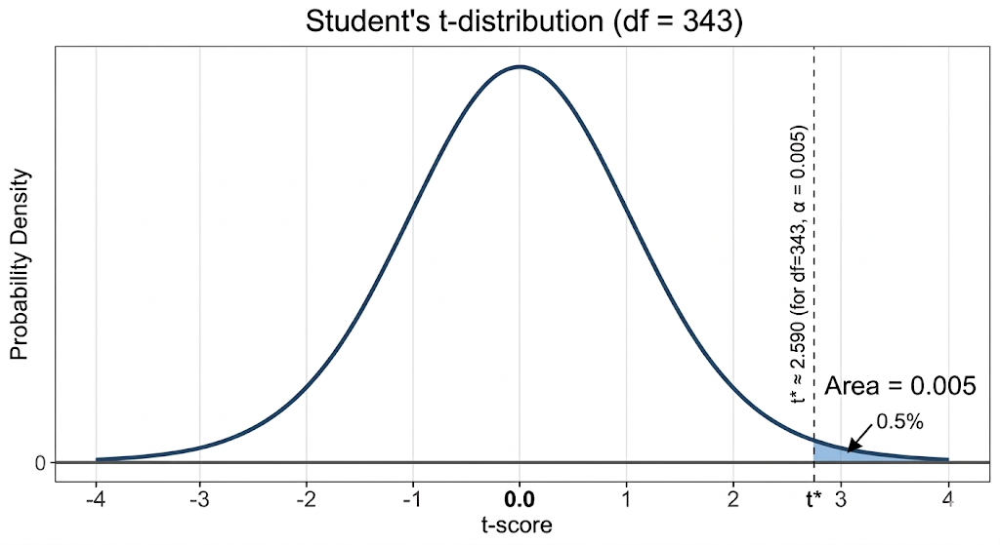

```{r packages, echo=FALSE, message=FALSE, warning=FALSE}
library(tidyverse)
library(mosaic)
```

## Outline

-   Review of $t$-test
-   Extension to the pooled $t$-test
-   The multiple comparison problem
-   Multiple comparison procedures
    -   Fisher’s LSD
    -   The Bonferroni method
    -   Tukey’s HSD method

## Load Libraries

```{r}
library(Stat2Data)
library(emmeans)
library(car)
library(multcomp)

```

## Case Study: Diet Restriction and Longevity (cont'd) {.smaller}

```{r}
library(readr)
micedata <- read_csv("http://people.kzoo.edu/enordmoe/math360/mice_diet_restrict.csv")
```

##  {.smaller}

### Diet Restriction Study: Treatment Groups

Treatment groups:

-   **NP**: unlimited nonpurified standard diet
-   **N/N85 (control)**: normal before/after weaning; 85 kcal/week after
    weaning
-   **N/R50**: normal before weaning; 50 kcal/week after weaning
-   **R/R50**: 50 kcal/week before and after weaning
-   **N/R50 lopro**: like N/R50, but protein decreases with advancing
    age
-   **N/R40**: normal before weaning; severely restricted after weaning

##  {.smaller}

### Boxplots by Treatment

```{r}
micedata2 <- mutate(micedata, Diet = factor(
  Diet,  levels = c("NP", "N/N85", "N/R50", "R/R50", "lopro", "N/R40")
))
gf_boxplot(Lifetime ~ Diet, data = micedata2) |>
  gf_jitter(width = .05)
```

##  {.smaller}

### Sample Means and Standard Deviations

```{r}
favstats(Lifetime ~ Diet, data = micedata2)
```

These are the group sample means and standard deviations.

## One-Way ANOVA Model

Model:

$$
Y = \mu + \alpha_i + \epsilon
$$

Fit the model.

```{r}
mod1 <- lm(Lifetime ~ Diet, data = micedata2)
anova(mod1)
```

# Multiple Comparisons {.peach-slide}

##  {.smaller}

### The Multiple Comparison Problem

If we perform many (all) pairwise $t$-tests:

-   Each test has probability $\alpha$ of Type I error
-   With many tests the **familywise false alarm rate increases**

::: fragment
Example:

10 tests at $\alpha = .05$

$$
FWER = 1 - (.95)^{10} \approx 0.40
$$
:::

::: fragment
40% chance of at least one false positive.
:::

##  {.smaller}

### Strategy

::: incremental
1.  Perform global ANOVA F-test

2.  If significant, perform follow-up comparisons
:::

::: fragment
**Goal**:

Identify **which means differ** while controlling error rates but no
adjustment for multiple comparisons.
:::

##  {.smaller}

### Intervals for Means Using the Estimated Marginal Means Framework

We use the **emmeans** framework (library).

-   These are the **model-based estimates** of the mean response for
    each group.

-   For one-way ANOVA, they just equal the sample means.

$$
\bar{y}_i \pm t^*_{n-I}\cdot \frac{SD}{\sqrt{n_i}}
$$

```{r}
mod1 <- lm(Lifetime ~ Diet, data = micedata2)
emm <- emmeans(mod1, ~ Diet)
emm
```

##  {.smaller}

### Fisher's Least Significant Difference (LSD) Method

Equivalent to **pairwise t-tests without adjustment**.

$$
(\bar{y}_i - \bar{y}_j) \pm
t^*_{n-I}\cdot SD\sqrt{\frac{1}{n_i} + \frac{1}{n_j}}
$$

```{r}
mod1 <- lm(Lifetime ~ Diet, data = micedata2)
emm <- emmeans(mod1, ~ Diet)
confint(pairs(emm, adjust = "none"))
```

# Fisher's Least Significant Difference (LSD) Method {.peach-slide}

##  {.smaller}
### Fisher's Least Significant Difference (LSD) Method

Characteristics:

-   Most **liberal** (no multiple comparison adjustment)
-   Often called a **protected test**
-   Should follow a significant ANOVA.

##  {.smaller}

### Goal of adjustment methods: Simultaneous Confidence

We want intervals such that

> **all intervals are correct with probability** $1-\alpha$

This is called **familywise confidence**.

::: fragment
For $m$ comparisons we want

$$
P(\text{all intervals cover the true differences}) \ge 1-\alpha
$$
:::


# Bonferroni Method {.peach-slide}

##  {.smaller}

### Bonferroni Idea

The **Bonferroni method** provides a simple solution.

If we construct $m$ intervals:

-   Use significance level

$$
\alpha/m
$$

for each comparison.

::: fragment
This ensures the probability of **any error** is no larger than
$\alpha$.
:::

##  {.smaller}

### Bonferroni Confidence Intervals

For two groups

$$
(\bar y_i - \bar y_j)
\pm
t^* s_p
\sqrt{\frac{1}{n_i} + \frac{1}{n_j}}
$$

where

$$
s_p = \sqrt{\text{MSE}}
$$

and

$$
t^* = t_{\alpha/(2m),\,df_E}
$$

This produces **simultaneous confidence level** $100(1-\alpha)\%$.

##  {.smaller}

### Bonferroni: Mice Diet Restriction Study Example

In the Fruit Flies experiment

-   Number of groups: $K = 5$

-   Number of comparisons

$$
m = \frac{K(K-1)}{2}
$$

$$
m = 10
$$

##  {.smaller}

### Bonferroni: Mice Diet Restriction Study Example

Desired overall level

$$
\alpha = 0.05
$$

::: fragment
Each comparison uses

$$
\alpha_{\text{each}} = \frac{0.05}{(2*5)} = 0.005
$$

This makes each interval **wider**, ensuring the overall confidence
level remains $95\%$.
:::

::: fragment
{fig-align="center" width="366"}
:::

## {.smaller}
### Mice Diet Restriction Example: Bonferroni Using R

::: {.fragment}


```{r}
pairs(emm, adjust = "bonferroni")
```

:::


## {.smaller}
### Key Idea

Bonferroni controls the **familywise confidence level** by making each individual interval **more conservative**.

::: {.fragment}

Advantages

-   Simple
-   Works for **any set of comparisons**

:::

::: {.fragment}


Disadvantage

-   Intervals can become **quite wide**, overly conservative

:::


# Tukey’s HSD Method {.peach-slide}


## {.smaller}
### Tukey's Pairwise Multiple Comparisons Method

Goal:

Construct **simultaneous confidence intervals** for all pairwise differences

$$
\mu_i - \mu_j
$$

among the population means.


## {.smaller}
### Tukey Simultaneous Confidence Intervals

The Tukey intervals have the form

$$
(\bar y_i - \bar y_j)
\pm
\frac{q^*}{\sqrt{2}}\, s_p
\sqrt{\frac{1}{n_i} + \frac{1}{n_j}}
$$

where

$$
s_p = \sqrt{\text{MSE}}
$$

and $q^*$ is the **upper $\alpha$ critical value from the Studentized range distribution**.


## {.smaller}
### Parameters of the Studentized Range Distribution

The critical value $q^*$ depends on

- $K$ = number of group means being compared

- $N-K$ = error degrees of freedom

These come directly from the **ANOVA model**.


## {.smaller}
### Equal vs Unequal Sample Sizes


If all sample sizes $n_i$ are **equal**

- the overall confidence level $C$ is **exact**.

::: {.fragment}

If sample sizes **differ**

- the true confidence level is **at least $C$**  
- therefore the method is **slightly conservative**.

:::

---

## {.smaller}
### Computational Note

The Tukey critical value can be obtained using `qtukey()`.

For the FruitFlies example:

- Number of groups: $I = 5$
- Error degrees of freedom:

$$
n - I = 125 - 5 = 120
$$

---

## Computing the Critical Value in R

```{r}
# Number of groups (means) = 5
# Error degrees of freedom = 120
qtukey(.95, nmeans = 5, df = 120)
```

## {.smaller}
### Tukey Critical Value

Thus the appropriate value is

$$
q^* \approx 3.917
$$

This value is used in the Tukey confidence interval formula

$$
(\bar y_i - \bar y_j)
\pm
\frac{q^*}{\sqrt{2}}, s_p
\sqrt{\frac{1}{n_i} + \frac{1}{n_j}}
$$

to obtain **simultaneous 95% confidence intervals**.


## {.smaller}
### Mice Diet Restriction Example: Tukey Using R

Tukey simultaneous intervals using **emmeans** package:

```{r}
confint(pairs(emm, adjust="tukey"))
```
::: {.fragment}

Interpretation: If an interval **does not contain 0**, the means differ.

:::


## {.smaller}
### Compact Letter Display


```{r}
cld(emm, adjust = "tukey")
```

::: {.fragment}


Interpretation:

Groups sharing a letter are **not significantly different**.

:::


## 
### Summary of Multiple Comparison Methods

| Method     | Characteristics                   |
|------------|-----------------------------------|
| Fisher LSD | Most liberal                      |
| Bonferroni | Conservative but general          |
| Tukey HSD  | Best for all pairwise comparisons |

Typical workflow:

1.  Perform ANOVA
2.  Use Tukey for follow-up comparisons


## {.smaller}
### Summary

* ANOVA tells us

  * whether any means differ

* Multiple comparison methods tell us

  * which means differ and by how much...
  * after adjusting for multiple comparisons
