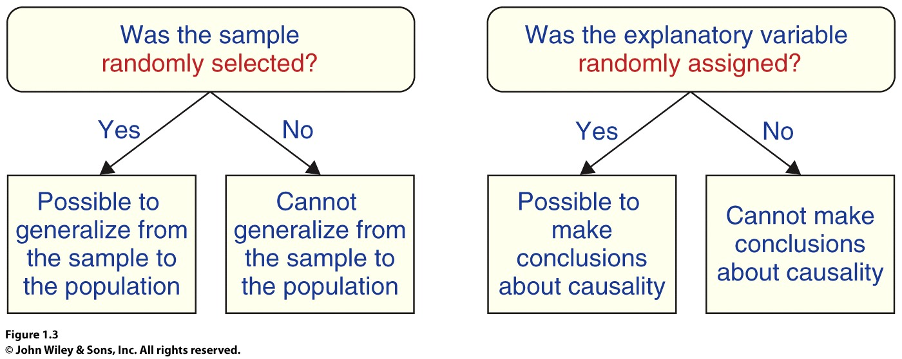
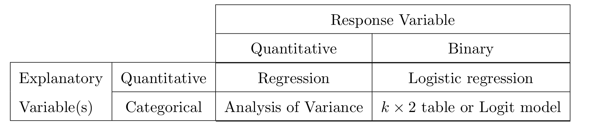

class: highlight-last-item

```{r setup, include=FALSE}
knitr::opts_chunk$set(
  fig.width=9, fig.height=4, fig.retina=3, 
  out.width="90%",
  message = FALSE
)

```


```{r packages, echo=FALSE, message=FALSE, warning=FALSE}
library(tidyverse)
library(rvest)
library(mosaic)
library(Stat2Data)
data("Day1Survey")

```

```{r xaringanExtra, echo=FALSE}
xaringanExtra::use_xaringan_extra(c("panelset", "scribble"))
xaringanExtra::use_clipboard()
xaringanExtra::use_tile_view()
```


```{css echo=FALSE}
.highlight-last-item > ul > li,
.highlight-last-item > ol > li {
  opacity: 0.5;
}
.highlight-last-item > ul > li:last-of-type,
.highlight-last-item > ol > li:last-of-type {
  opacity: 1;
}
```

# Outline 

- Review of Stats I

--

- Statistical modeling

--

- Fundamentals

--

- Design and Inference

--

- Examples


---
background-image: url(figures/Inference_Roadmap_Review.png)
background-size: contain


---
class: highlight-last-item

# Data  

- Data are numbers with a context. 

--

- Modeling mindset
$$
\mbox{Data} = \mbox{Pattern} + \mbox{Departures from a pattern}
$$

--

- How to identify the pattern?

---
# General form of a model

- The intuitive statistical modeling idea:

$$
\mbox{Data} = \mbox{Model} + \mbox{Error}
$$

--

- More formally, we have:

$$
Y= f(X) + \epsilon
$$

---
background-image: url(figures/chris-leipelt-IYOJOCQOtBg-unsplash.jpg)
background-size: 300px
background-position: 75% 75%

# Purposes of Statistical Modeling

.pull-left[
1. Making predictions

1. Understanding relationships

1. Assessing differences
]

--

.pull-right[
- Obtaining confidence intervals

- Testing hypotheses
]

---
background-image: url(figures/alan-king-KZv7w34tluA-unsplash.jpg)
background-size: 200px
background-position: 90% 8%

# Fundamentals  

## Building blocks  

--

  - **Observational units.** in a study are the people, objects, or cases on<br> which
  data are recorded. 

--


## Variables in a modeling framework

--

**Response variable.** the variable that measures the outcome of interest; typically the variable whose value we would like to predict.  

--

**Explanatory variable(s).** the variable(s) whose relationship to the response is being studied.  


---
class: highlight-last-item

# Types of Variables

- **Quantitative**: expressible as numbers for which arithmetic makes sense

--

- **Categorical**: divides sample observations into groups

--

  - **Binary**: categorical with just two groups

---

---
class: highlight-last-item

# Types of Studies


- **Observational study**: Data are recorded without "manipulating" any of the variables.

--

- **Statistical experiment**: One or more of the explanatory variables is/are assigned/controlled for all experimental units.

--

**Question:** How is the type of study related to the kinds of inference that can be made? 


---
# Design and Inference

```{r out.width = '90%', echo = FALSE}
# local

```

Source: *Statistics: Unlocking the Power of Data*

---

# Sample Dataset
.panelset[
```{r, panelset = TRUE}
# Show the first ten rows of Day1Survey
head(Day1Survey, n = 6)
```
]


---
# Modeling Matrix: Our Course Summary


```{r out.width = '90%', echo = FALSE}
# local

```

---
class: inverse, center, middle


# Case Study 

---
# Study of Treaments of Anorexia

- A study of the effect of  therapies for anorexia patients

  - Family Therapy
  
  - Cognitive Behavioral Therapy
  
  - A Control Therapy
  
--

- Variables of interest

  - *gain*: weight gain over the course of the study
  
  - *group*: treatment group
  
--
  
- Research question of interest

  - Does Family Therapy increase weight gain compared to the control therapy?

---

## Describing the Data: Numerically


.panelset[
```{r, panelset = TRUE}
# Import the data from the web
anorexia <- read.csv("http://people.kzoo.edu/enordmoe/math260/data/anorexia.csv")
# View the first few rows of the data
head(anorexia, n=10)
tally(~group, data = anorexia)
```
]


---
## Describing the Data: Graphically


.panelset[
.panel[.panel-name[R Code]
```{r anorex_plots, eval = FALSE}
gf_dotplot(~gain | group~., data = anorexia)
gf_boxploth(group ~ gain, data = anorexia)
```
]
.panel[.panel-name[Dotplot]
```{r anorex_plots2, echo = FALSE}
gf_dotplot(~gain | group~., data = anorexia)
```
]
.panel[.panel-name[Boxplot]
```{r anorex_plots3, echo = FALSE}
gf_boxploth(group ~ gain, data = anorexia)
```
]
]

<!----->