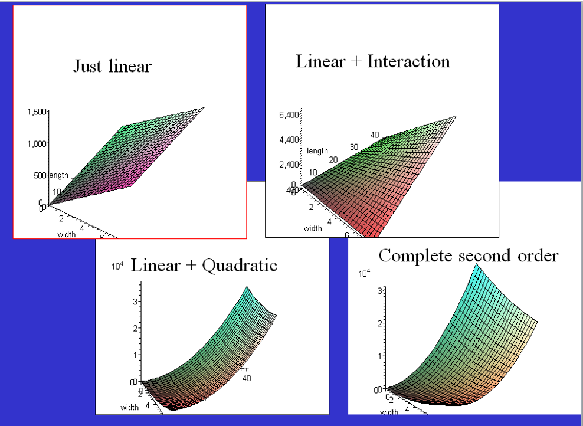

```{r setup, include=FALSE}
knitr::opts_chunk$set(echo = TRUE)
library(mosaic)
library(gridExtra)
```

## Code Panelsets

.panelset[

```{r, panelset = TRUE, fig.height = 3.5}
lm.2lines = lm(tswirl ~ dist + height.hi + dist * height.hi, data = funnel.hilo)
summary(lm.2lines)
```
]

---

## Panelsets

.panelset[
.panel[.panel-name[tab_title]
```{r echo=FALSE, fig.height=3}
# Code here
# Code here
```
]
.panel[.panel-name[tab_title]
{text or chunks here}
]
.panel[.panel-name[Output]
```{r echo=FALSE}
mod2 <- lm(SqrtMDs ~ Hospitals, data = CountyHealth)
mod2
```
]
]

## Access Chunk Label

.panelset[
.panel[.panel-name[3 parallel lines code]
```{r parmod_code,eval = FALSE, fig.height=3}
lm.parallel3 <- lm(tswirl ~ dist + factor(height), data = funneldata)
summary(lm.parallel3)
```
]
.panel[.panel-name[3 parallel lines output]
```{r parmod_code-out, ref.label="parmod_code", echo = FALSE}
```

]
.panel[.panel-name[3 lines code]
```{r lines_mod_code, eval = FALSE, fig.height = 3}
lm.3lines <- lm(tswirl ~ dist + factor(height) + dist:factor(height), 
             data = funneldata)
summary(lm.3lines)
```
]
.panel[.panel-name[3 lines output]
```{r lines_mod-out, ref.label = "lines_mod_code", echo=FALSE}
```
]
]


## Grid Plots

```{r}
plot1 <- gf_histogram(~resid(mod2))
plot2 <- gf_qq(~resid(mod2)) %>%
  gf_qqline()
grid.arrange(plot1, plot2, ncol=2)
```

## Plotly Example

```{r, panelset = TRUE}
#install.packages("plotly")
library(plotly)
p <- gf_point(Gold ~ Year, data = LongJumpOlympics)
ggplotly(p)
```

## Full screen image

background-image: url(https://www.liverpool.ac.uk/pfg/Who/Blog/files/2088_c953_512.gif)
background-size: contain


## Image using R code

```{r, out.width='90%', fig.align='center'}

```

