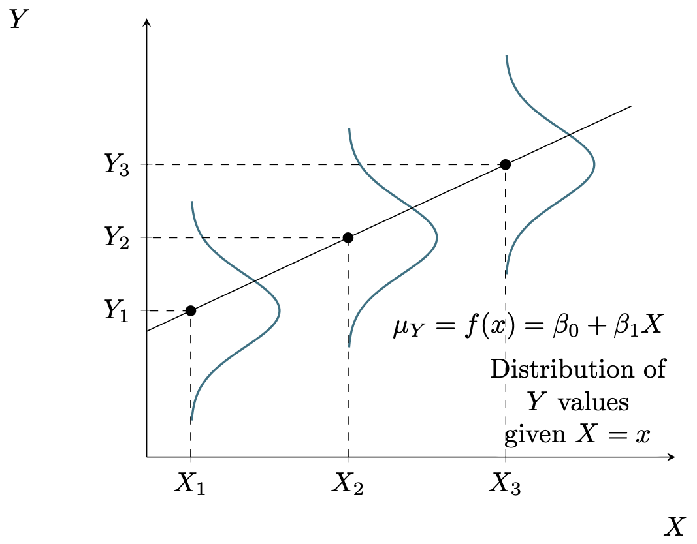

class: highlight-last-item

```{r setup, include=FALSE}
knitr::opts_chunk$set(
  fig.width=9, fig.height=4, fig.retina=3, 
  out.width="90%",
  message = FALSE
)

```


```{r packages, echo=FALSE, message=FALSE, warning=FALSE}
library(tidyverse)
library(rvest)
library(mosaic)
library(Stat2Data)
data("SpeciesArea")
data("CountyHealth")
```

```{r xaringanExtra, echo=FALSE}
xaringanExtra::use_xaringan_extra(c("panelset", "scribble"))
xaringanExtra::use_clipboard()
xaringanExtra::use_tile_view()
```


```{css echo=FALSE}
.highlight-last-item > ul > li,
.highlight-last-item > ol > li {
  opacity: 0.5;
}
.highlight-last-item > ul > li:last-of-type,
.highlight-last-item > ol > li:last-of-type {
  opacity: 1;
}
```

# Outline 

- Simple linear model conditions

--

- Checking conditions
  
---

### The Simple Linear Regression Model with Conditions

* For a quantitative response variable $Y$  and a single quantitative explanatory variable $X$, the **simple linear regression model** is

$$
Y = \beta_0 + \beta_1 X + \epsilon
$$

where $\epsilon$ follows a normal distribution, that is, $\epsilon\sim N(0,\sigma_\epsilon)$ and the errors are independent from one another.

--

- Two Parts

  - The model
  
  - The conditions
---
### The Simple Linear Regression Model Graphically

```{r reg_mod, echo=FALSE, out.width="700px", fig.align='center'}
# local

```

---
class: highlight-last-item

### I Mneed a  Mnemonic Device: LINC-R


- **Linearity**: overall relationship is linear.

--

- **Independence**: errors are assumed to be independent of each other.

--

- **Normality**: unseen errors $\epsilon$ are normally distributed.

  - Needed for confidence intervals and hypothesis tests based on $t$-distribution.
  
--

- **Constant variance** (Uniform spread) variabilty of response does not change as the predictor changes.

--

- **Randomness** - data are obtained using a random process.

  - Sampling model determines scope of inference 

---
### Estimating the Standard Deviation $\sigma_\epsilon$ of the Error Term 

- True errors $\epsilon$ are unobserved

--

- Estimate *unobserved* variability in errors $\sigma_\epsilon$ using *observed* variability in residuals $y-\hat y$.

--

- The **Standard Error of Regression** is the estimated standard deviation of the error term based on the least squares fit to a sample of $n$ observations:

$$
\hat\sigma_\epsilon=\sqrt{\frac{\sum(y-\hat y)^2}{n-2}}= \sqrt{\frac{\mbox{SSE}}{n-2}}
$$

- Note the divisor $n-2$ is known as the *degrees of freedom* of the regression.

---


### Example: Predicting Final Score from Midterm Score Revisited

```{r}
MidtermFinal <- read.csv("http://people.kzoo.edu/enordmoe/math360/MidtermFinal.csv")
dim(MidtermFinal)
```

- First 6 cases

```{r, echo = FALSE}
knitr::kable(head(MidtermFinal), format = 'html')
```

---

### Example Revisited: Using R to Find and Plot the Regression Line

.panelset[
.panel[.panel-name[R Code]
```{r lsmod1, eval = FALSE}
# Fit and save the regression model
gf_point(Final ~ Midterm, data = MidtermFinal) %>%
  gf_smooth(method = "lm")

```
]
.panel[.panel-name[Regression Output]
```{r lsmod2, echo = FALSE}
# Fit and save the regression model
model1 <- lm(Final ~ Midterm, data = MidtermFinal)
#Obtain regression output including slope and intercept
summary(model1)
```
]
.panel[.panel-name[Scatterplot with Regresson Line]
```{r lsmod3, echo = FALSE}
# Graph regression line on scatterplot
gf_point(Final ~ Midterm, data = MidtermFinal, 
         xlab = "Midterm Score", ylab = "Final Score") %>%
  gf_smooth(method = "lm")
```
]
]

---

# What is in an `lm()`?

| Command                             | Contents                     |
|-------------------------------------|------------------------------|
| `model1$fitted` or `fitted(model1)` | predicted values $\hat y$    |
| `model1$resid` or `resid(model1)`   | residuals $y-\hat y$         |
| `model1$coeff` or `coef(model1)`    | estimated model coefficients |
| `model1$call`                       | the form of the model        |
| `model1$model`                      | data used for the model      |


- These can be used in calculations and plots.

---
# Special functions for an `lm()`

| Command                             | Contents                     |
|-------------------------------------|------------------------------|
| `model1` | call and coefficients    |
| `summary(model1)`   | lots of stuff |
| `summary(model1)$sigma`    | std error of regression $\hat\sigma_\epsilon$ |
| `anova(model1)`                       | ANOVA table (Chapter 2)        |

---
## Checking Linearity: 1. Scatterplots

.panelset[
.panel[.panel-name[R Code]
```{r scat1, eval = FALSE}
# Example 1
gf_point(Final ~ Midterm, data = MidtermFinal) %>%
  gf_smooth(method = "lm")
# Example 2
gf_point(Species ~ Area, data = SpeciesArea) %>%
  gf_smooth(method = "lm")
```
]
.panel[.panel-name[Roughly Linear Plot]
```{r scat2, echo = FALSE}
gf_point(Final ~ Midterm, data = MidtermFinal) %>%
  gf_smooth(method = "lm")
```
]
.panel[.panel-name[Curved Plot]
```{r scat3, echo = FALSE}
gf_point(Species ~ Area, data = SpeciesArea) %>%
  gf_smooth(method = "lm")
```
]
]


---
## Checking Linearity: 2. Plot Residuals vs Predicted

.panelset[
.panel[.panel-name[R Code]
```{r rvp1, eval = FALSE}
# Example 1
m1 <- lm(Final ~ Midterm, data = MidtermFinal)
gf_point(resid(m1) ~ fitted(m1)) %>%
  gf_hline(yintercept = ~0, color = "blue")

# Example 2
m2 <- lm(Species ~ Area, data = SpeciesArea)
gf_point(resid(m2) ~ fitted(m2)) %>%
  gf_hline(yintercept = ~0, color = "blue")
```
]
.panel[.panel-name[Roughly Linear Plot]
```{r rvp2, echo = FALSE}
m1 <- lm(Final ~ Midterm, data = MidtermFinal)
gf_point(resid(m1) ~ fitted(m1)) %>%
  gf_hline(yintercept = ~0, color = "blue")
```
]
.panel[.panel-name[Curved Plot]
```{r rvp3, echo = FALSE}
m2 <- lm(Species ~ Area, data = SpeciesArea)
gf_point(resid(m2) ~ fitted(m2)) %>%
  gf_hline(yintercept = ~0, color = "blue")
```
]
]


---

## Checking Constant Variance: 1. Scatterplot

.panelset[
.panel[.panel-name[R Code]
```{r, eval = FALSE}
# Example 1
 gf_point(Final ~ Midterm, data = MidtermFinal) %>%
  gf_smooth(method = "lm")

# Example 2
gf_point(MDs ~ Hospitals, data = CountyHealth) %>%
  gf_smooth(method = "lm")
```
]
.panel[.panel-name[Constant Variance]
```{r , echo = FALSE}
gf_point(Final ~ Midterm, data = MidtermFinal) %>%
  gf_smooth(method = "lm")
```
]
.panel[.panel-name[Increasing Error Variance]
```{r , echo = FALSE}
gf_point(MDs ~ Hospitals, data = CountyHealth) %>%
  gf_smooth(method = "lm")
```
]
]


---
### Checking Constant Variance: 2. Plot of Residuals vs Predictions

.panelset[
.panel[.panel-name[R Code]
```{r, eval = FALSE}
# Example 1
m1 <- lm(Final ~ Midterm, data = MidtermFinal)
gf_point(resid(m1) ~ fitted(m1)) %>%
  gf_hline(yintercept = ~0, color = "blue")

# Example 2
m2 <- lm(MDs ~ Hospitals, data = CountyHealth)
gf_point(resid(m2) ~ fitted(m2)) %>%
  gf_hline(yintercept = ~0, color = "blue")

```
]
.panel[.panel-name[Constant Variance]
```{r , echo = FALSE}
m1 <- lm(Final ~ Midterm, data = MidtermFinal)
gf_point(resid(m1) ~ fitted(m1)) %>%
  gf_hline(yintercept = ~0, color = "blue")
```
]
.panel[.panel-name[Increasing Error Variance]
```{r , echo = FALSE}
m2 <- lm(MDs ~ Hospitals, data = CountyHealth)
gf_point(resid(m2) ~ fitted(m2)) %>%
  gf_hline(yintercept = ~0, color = "blue")
```
]
]

---

### Checking Normality of Errors: 1. Histogram of $y -\hat y$

.panelset[
.panel[.panel-name[R Code]
```{r, eval = FALSE}
# Example 1
m1 <- lm(Final ~ Midterm, data = MidtermFinal)
gf_histogram(~resid(m1))
# Example 2
m2 <- lm(MDs ~ Hospitals, data = CountyHealth)
gf_histogram(~resid(m2))
```
]
.panel[.panel-name[Normal Residuals]
```{r , echo = FALSE}
m1 <- lm(Final ~ Midterm, data = MidtermFinal)
gf_histogram(~resid(m1))
```
]
.panel[.panel-name[Nonnormal Residuals]
```{r , echo = FALSE}
m2 <- lm(MDs ~ Hospitals, data = CountyHealth)
gf_histogram(~resid(m2))
```
]
]

---

### Checking Normality of Errors: 1'. Density Plot of $y-\hat y$

.panelset[
.panel[.panel-name[R Code]
```{r, eval = FALSE}
# Example 1
m1 <- lm(Final ~ Midterm, data = MidtermFinal)
gf_density(~resid(m1))
# Example 2
m2 <- lm(MDs ~ Hospitals, data = CountyHealth)
gf_density(~resid(m2))
```
]
.panel[.panel-name[Normal Residuals]
```{r , echo = FALSE}
m1 <- lm(Final ~ Midterm, data = MidtermFinal)
gf_density(~resid(m1))
```
]
.panel[.panel-name[Nonnormal Residuals]
```{r , echo = FALSE}
m2 <- lm(MDs ~ Hospitals, data = CountyHealth)
gf_density(~resid(m2))
```
]
]

---

### Checking Normality of Errors: 2. Normal Quantile Plots of $y-\hat y$

.panelset[
.panel[.panel-name[R Code]
```{r, eval = FALSE}
# Example 1
m1 <- lm(Final ~ Midterm, data = MidtermFinal)
gf_qq(~resid(m1)) %>%
  gf_qqline()
# Example 2
m2 <- lm(MDs ~ Hospitals, data = CountyHealth)
gf_qq(~resid(m2)) %>%
  gf_qqline()
```
]
.panel[.panel-name[Normal Residuals]
```{r , echo = FALSE}
m1 <- lm(Final ~ Midterm, data = MidtermFinal)
gf_qq(~resid(m1)) %>%
  gf_qqline()
```
]
.panel[.panel-name[Nonnormal Residuals]
```{r , echo = FALSE}
m2 <- lm(MDs ~ Hospitals, data = CountyHealth)
gf_qq(~resid(m2)) %>%
  gf_qqline()
```
]
]


---
class: highlight-last-item

# Checking Randomness and Independence

- Typically cannot be checked by inspection of the data

--

- Independence violations

--

  - Time series data
  
--

  - Multiple observations from the same family, school, classroom, $\ldots$
  
--

- Randomness violations affect scope of inference

--

  - Nonrandom sampling
  
--

  - Experimental design

---
class: highlight-last-item

# Summary

- Regression model conditions: LINC-R

--

- Carry out checks of model conditions using R

--

- What to do if conditions are not satisfied?

--

  - Stay tuned...
