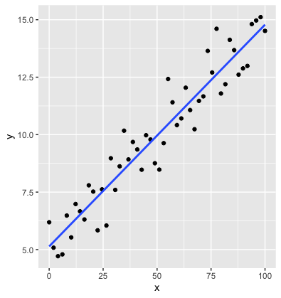

## Questions

1. What connections can you find between these two sets of results?

2. Is the regression *practically significant*?

3. What's the deal with the `Multiple R-squared`?


---

### What is $r^2$? 

- $r^2$ is the proportion of total variability in the response $(Y)$ that is "explained" by the model.

- $r^2$ can be calculated from the ANOVA decomposition:
$$
r^2 = \frac{\mbox{SSModel}}{\mbox{SSTotal}}=1- \frac{\mbox{SSE}}{\mbox{SSTotal}}
$$
<br>
- **Your turn:** Check using R output for **MidtermFinal** data. 

--

  - Check: $r^2=0.569\Rightarrow$ The model explains 56.9% of the variability in Final Exam scores.
  
  
---

### Why is it called $r^2$? 

.pull-left[

]
.pull-right[

]

---

## Testing the Significance of a Regression

- Test based on the correlation coefficient

$$
\begin{align}
H_0:&\rho=0 \\
H_a:&\rho\neq 0 \\
\end{align}
$$

- Test statistic

$$
t=\frac{r\sqrt{n-2}}{\sqrt{1-r^2}} \sim t_{n-2}
$$

- Find the $p$-value using a $t$ distribution with $n-2$ degrees of freedom.

---
## Test of Correlation Using R Software

```{r}
cor.test(Final~Midterm, data = MidtermFinal)
```

- **Question:** What numbers look familiar?

---
## Three Regression Tests

### 1. $t$-test for slope

.pull-left[
**Hypotheses**
$$
\begin{align}
H_0:&\beta_1=0 \\
H_a:&\beta_1\neq 0 \\
\end{align}
$$
]
.pull-right[
**Test statistic**
$$t=\frac{\hat\beta_1}{\mbox{SE}_{\hat\beta_1}}\sim t_{n-2}$$
]

---

## Three Regression Tests

### 2. ANOVA for  regression $F$-test 

.pull-left[
**Hypotheses**
$$
\begin{align}
H_0:&\beta_1=0 \\
H_a:&\beta_1\neq 0 \\
\end{align}
$$
]
.pull-right[
**Test statistic**
$$F=\frac{\mbox{MSModel}}{\mbox{MSE}}\sim F_{1,n-2}$$
]


---

## Three Regression Tests

### 3. $t$-test for Correlation Coefficient

.pull-left[
**Hypotheses**
$$
\begin{align}
H_0:&\rho=0 \\
H_a:&\rho\neq 0 \\
\end{align}
$$
]
.pull-right[
**Test statistic**
$$t=\frac{r\sqrt{n-2}}{\sqrt{1-r^2}} \sim t_{n-2}$$
]

---

### Three Regressions Tests

- All three are equivalent

- All test the significance of the linear regression relationship

---

### Effect sizes

- Why is the following a meaningful measure of **effect size**

$$
f^2 = \frac{R^2}{1-R^2}
$$

  - This is known as **Cohen's $f^2$**.